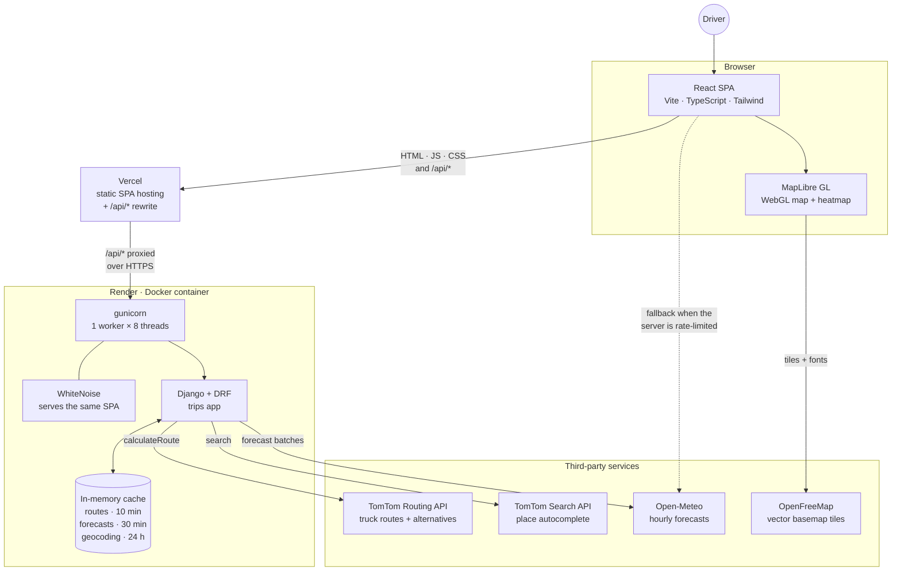
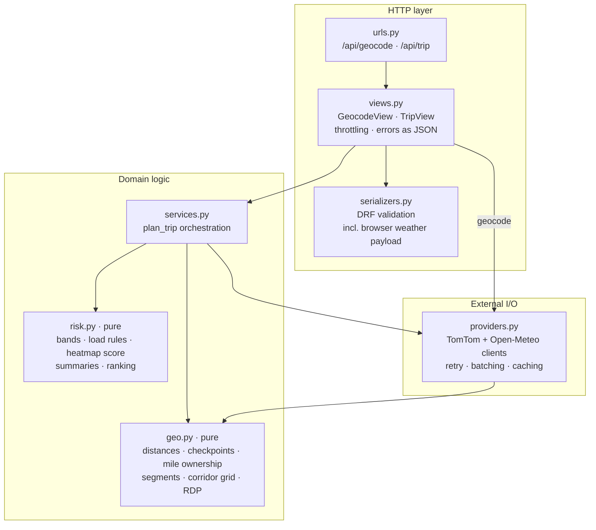
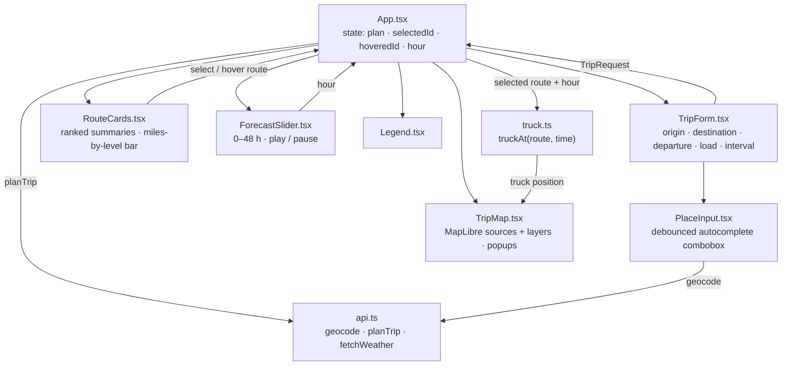
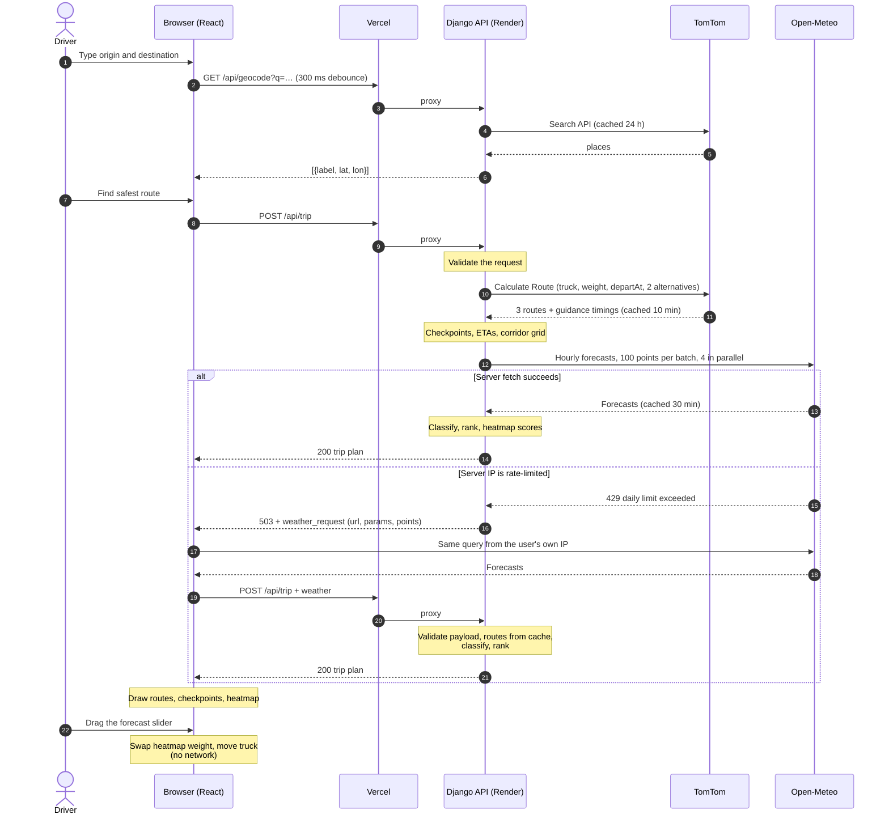
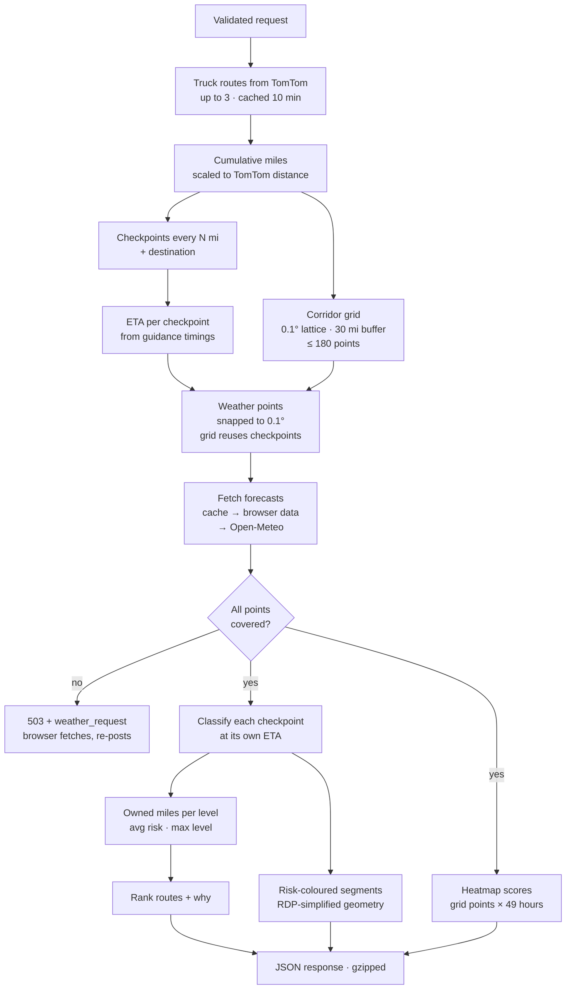
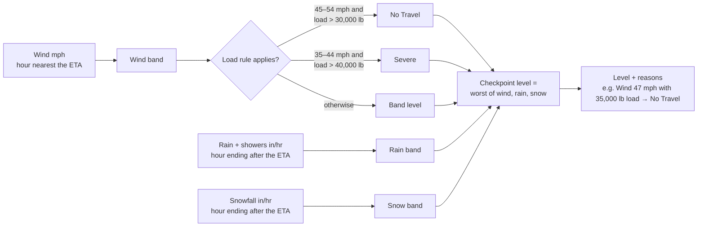
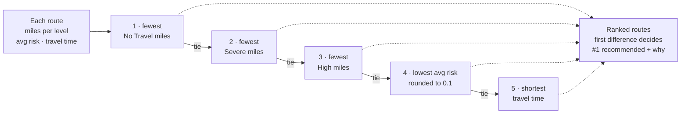
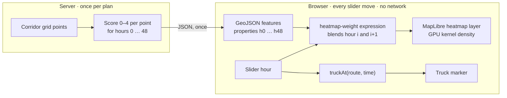

# Weather-Aware Truck Routing

React + Django app that helps a truck driver pick the safest route. It weighs forecast weather at the
truck's ETA, the load weight, and travel time.

- **Live app:** https://weather-aware-truck-routing.vercel.app (Vercel frontend, `/api` proxied to Render)
  · direct: https://weather-truck-routing.onrender.com (free tier: the first request after ~15 min idle takes ~50 s)
- **Walkthrough (Loom):** https://www.loom.com/share/620c16671c004dcaaf25ab50abf721c6

## What it does

1. The driver enters origin, destination, departure time, load weight and a checkpoint interval (10 / 25 / 50 mi).
2. The backend asks TomTom for **3 truck routes**. The request uses `travelMode=truck`, the gross vehicle weight and the departure time, so traffic is predicted for that time.
3. Each route gets a **checkpoint every N miles** plus one at the destination. Each checkpoint has an **ETA** taken from TomTom's per-instruction travel times, so city and highway stretches each get their own speed.
4. Weather comes from **Open-Meteo hourly forecasts at each checkpoint's ETA** and is rated **Low → No Travel** with the risk table and the load rules.
5. Routes are **ranked**, and the best one is recommended with a one-line reason.
6. The map shows all routes, colour-coded checkpoints with popups (ETA, wind, gusts, rain, snow, reasons), route summary labels, and a **corridor weather heatmap with a 0–48 h forecast slider**. A truck marker shows where the selected route's truck is at the slider time.

## Contents

[Architecture](#architecture) · [How a trip is planned](#how-a-trip-is-planned) · [Risk rules](#risk-rules) ·
[Recommendation](#recommendation) · [Weather sampling](#weather-sampling) · [Corridor heatmap](#corridor-heatmap) ·
[Performance](#performance) · [API](#api) · [Running locally](#running-locally) · [Deploying](#deploying) ·
[Assumptions and limitations](#assumptions-and-limitations)

## Architecture

### System overview



- **One request, one answer:** `POST /api/trip` returns everything the UI needs: routes, checkpoints,
  summaries, the recommendation and the heatmap. After that, the slider runs entirely in the browser.
- **Two ways in:** Vercel serves the SPA from its CDN and proxies `/api/*` to Render, so the browser sees a
  single origin and no CORS setup is needed. Render also serves the same SPA itself through WhiteNoise.
- **API keys stay server-side:** the browser never sees the TomTom key. Its only direct third-party calls
  are map tiles and, in the rate-limit fallback, the keyless Open-Meteo forecast API.

### Backend modules



`risk.py` and `geo.py` have no I/O, so the rules that carry the grade are unit-tested directly
(`backend/trips/tests.py`: every threshold boundary, the load rules, ranking, mile ownership, ETA and hour
selection, provider parsing, payload validation and the weather fallback).

### Frontend components



The map layers, from bottom to top, are: basemap, corridor heatmap (under the basemap labels), alternative
routes in gray, the selected route coloured by risk, checkpoints, origin and destination, route summary
labels, and the truck marker. Selecting or hovering a route only changes layer filters and paint properties.

### Repository layout

```
backend/
  config/            settings (env validated at startup), urls, wsgi
  trips/
    risk.py          risk bands, load rules, continuous heatmap score, summaries, ranking   (pure)
    geo.py           distances, interpolation, checkpoints, mile ownership, grid, RDP      (pure)
    providers.py     TomTom + Open-Meteo clients (retry, batching, caching, browser fallback)
    services.py      plan_trip(): orchestration
    serializers.py   request validation        views.py / urls.py   HTTP
    tests.py         unit tests
frontend/
  src/App.tsx        page layout and state
  src/api.ts         API client, including the browser weather fallback
  src/truck.ts       truck position at a given time (ETA -> mile -> point)
  src/risk.ts        level names, colours, formatting
  src/components/    TripForm, PlaceInput, RouteCards, TripMap, ForecastSlider, Legend
  vercel.json        /api rewrite to Render
Dockerfile           one image: builds the SPA, then runs Django + WhiteNoise under gunicorn
render.yaml          Render blueprint
```

## How a trip is planned

### Request flow



Responses travel back through the Vercel proxy; the diagram draws them directly to keep it readable.

### Inside `plan_trip`



## Risk rules

Each checkpoint's level is the **worst** of wind (after load rules), rain and snow.

| Condition   | Low      | Moderate    | High        | Severe      | No Travel |
|-------------|----------|-------------|-------------|-------------|-----------|
| Wind (mph)  | < 25     | 25 – < 35   | 35 – < 45   | 45 – < 55   | ≥ 55      |
| Rain (in/hr)| < 0.10   | 0.10 – < 0.25 | 0.25 – < 0.50 | 0.50 – 1.00 | > 1.00  |
| Snow (in/hr)| < 0.5    | 0.5 – < 1.0 | 1.0 – < 2.0 | 2.0 – 3.0   | > 3.0     |

The spec's ranges share their endpoints (0.10–0.25, 0.25–0.50). Each band here includes its lower bound,
so 0.25 in/hr is High. "No Travel" follows the spec's `>` for rain and snow and `≥` for wind.

**Load rules** (wind only): ≥ 55 mph → No Travel for any load. 45–54 mph with load > 30,000 lb → No Travel.
35–44 mph with load > 40,000 lb → Severe.



## Recommendation

Routes are sorted by this tuple:

```
(No Travel miles, Severe miles, High miles, round(avg risk, 1), travel time)
```



How checkpoint miles are counted, for a 25-mile route at a 10-mile interval:

```
checkpoints     0 ───────── 10 ───────── 20 ──── 25 mi
owns          [0–5]      [5–15]      [15–22.5] [22.5–25]
owned miles     5          10          7.5       2.5      = 25 mi
```

- **Miles per level:** each checkpoint "owns" the stretch of road between the midpoints to its neighbours,
  so owned miles add up exactly to the route length. Average risk is the mile-weighted mean level (0–4).
- **No Travel is counted before Severe.** The spec ranks by "fewest Severe miles", but a No Travel mile is
  strictly worse, so 10 No Travel miles should never beat 50 Severe ones.
- **Average risk is compared at 0.1 resolution.** Without this, float noise would decide almost every tie
  and travel time would never count. Routes with near-identical risk fall through to the faster one.
- Each route gets a reason built from the first criterion where it differs from its comparison route,
  e.g. *"Best on Severe miles: 0 mi vs 12 mi on the next best route"*.
- If every route has No Travel miles, the UI suggests delaying departure.

## Weather sampling

- **Variables:** Open-Meteo `wind_speed_10m`, `wind_gusts_10m`, `rain` + `showers` (convective rain is
  reported separately and would otherwise be missed) and `snowfall`, in mph and inches.
- **Hour selection:** wind uses the hour nearest the ETA. Rain and snow use the hour *ending* after the ETA,
  because Open-Meteo reports precipitation as the total for the preceding hour.
- **Wind speed:** classification uses sustained wind. Gusts are shown in popups but are not part of the rules.
- **Fewer API calls:** checkpoints snap to a global 0.1° lattice (~7 mi). Overlapping routes and repeat
  requests then share forecasts, which are cached for 30 minutes. Heatmap grid nodes reuse any checkpoint
  forecast within half a grid step, so only off-route nodes need their own call.
- **Rate limits and shared IPs:** Open-Meteo limits free use per IP, and cloud hosts share outbound IPs.
  On Render's free tier the shared IP had already used up the daily quota. When the server can't fetch
  forecasts, `/api/trip` returns 503 with a `weather_request` (URL, parameters, points). The browser
  fetches those forecasts on its own IP quota and re-posts the trip with the raw data. The server
  validates that data and runs it through the same parsing, risk and ranking code, and routes are cached
  between the two requests. Forecast batches also retry once on timeouts and 5xx errors. If forecasts are
  still missing after the browser's attempt, the heatmap thins out; missing checkpoint weather fails the request.

## Corridor heatmap



- The backend builds a lattice of points within 30 mi of any route. Spacing adapts so there are at most
  ~180 points, and points are multiples of 0.1° so they share the weather cache.
- For each point it computes a **continuous, load-aware 0–4 score** for every hour 0–48 after departure.
  The score is piecewise-linear between the same thresholds, so its integer part matches the discrete level.
- The UI loads these as one MapLibre GeoJSON source with properties `h0..h48`. Moving the slider only swaps
  the `heatmap-weight` expression, blending neighbouring hours for smooth playback. It is GPU-rendered and
  makes no network calls.
- The kernel radius scales with grid spacing and zoom, so heat density ≈ score and the colours line up with
  the risk levels.

## Performance

- **Map:** routes, checkpoints, labels and the heatmap are GeoJSON sources drawn by WebGL layers, with no DOM
  markers. Selecting or hovering a route changes filters and paint properties only.
- **Payload:** route geometry is simplified server-side with Ramer–Douglas–Peucker at ~20 m tolerance.
  For Chicago → Denver this cuts ~40k to ~3.5k vertices. API responses are gzipped (~30 KB on the wire for a
  1,000-mile trip at 25 mi), and the built JS/CSS is pre-compressed and served with immutable caching.
- **Latency:** TomTom truck routing with alternatives takes ~4–6 s for a 1,000-mile trip, and fresh weather
  takes 1–3 s. Routes are cached for 10 minutes per origin, destination, load and departure slot, so
  re-planning at another checkpoint interval returns in under a second.

## API

`GET /api/geocode?q=chicago` → `[{label, lat, lon}]`

`POST /api/trip`
```json
{ "origin": {"lat": 41.88, "lon": -87.63, "label": "Chicago, IL"},
  "destination": {"lat": 39.74, "lon": -104.99, "label": "Denver, CO"},
  "departure": "2026-10-10T14:00:00Z", "load_lbs": 42000, "interval_miles": 25 }
```
→ `{ departure, recommended_id, all_routes_unsafe, routes: [{ id, rank, why, distance_mi, duration_s, arrival,
segments: [{level, coords}], checkpoints: [{mile, lat, lon, eta, wind_mph, gust_mph, rain_in, snow_in, level, reasons}],
summary: {miles_by_level, avg_risk, max_level} }], heatmap: { start, step_deg, points, scores } }`

Optional `weather: [{lat, lon, hourly}]` carries browser-fetched Open-Meteo data after a 503 response that
includes `weather_request` (see Weather sampling).

Input rules: departure must be between now and 7 days ahead; load must be 0–80,000 lb; the interval must be
10, 25 or 50 mi; origin and destination must be at least 1 mi apart. Provider failures return 502/503 and
"no route" returns 422, each with a `detail` message.

## Running locally

Requirements: Python 3.12, Node 22+, and a free [TomTom API key](https://developer.tomtom.com) with the
Routing and Search APIs enabled.

```bash
# backend
cd backend
python -m venv .venv && .venv/bin/pip install -r requirements.txt
cp .env.example .env            # then set TOMTOM_API_KEY
.venv/bin/python manage.py runserver

# frontend (new terminal); Vite proxies /api to :8000
cd frontend && npm install && npm run dev
```

Tests cover risk bands at every threshold, load rules, ranking, mile ownership, ETA and hour selection,
and TomTom parsing:
```bash
cd backend && .venv/bin/python manage.py test trips
```

Docker (same image as production; Django serves the built SPA through WhiteNoise):
```bash
docker build -t weather-truck-routing .
docker run -p 8000:8000 -e TOMTOM_API_KEY=... -e SECRET_KEY=... weather-truck-routing
```

## Deploying

**Render (API + app):** `render.yaml` defines a free Docker web service. Create a new Blueprint from this
repo, set `TOMTOM_API_KEY` when prompted, and deploy. `SECRET_KEY` is generated for you. The free tier
sleeps after 15 minutes idle, so the first request after that takes about 50 s.

**Vercel (frontend):** deploy the `frontend/` directory as a Vite project. `frontend/vercel.json` rewrites
`/api/*` to the Render service, so the browser talks to a single origin and no CORS setup is needed.
Vercel's proxy waits up to 120 s, which covers a Render cold start.

## Assumptions and limitations

- **ETAs are continuous drive time** from TomTom's truck profile. Hours-of-Service breaks (30 min after
  8 h, 10 h rest after 11 h) are not added, so multi-day ETAs are optimistic.
- **Load weight is cargo weight.** TomTom routing gets gross weight = load + 35,000 lb typical tare.
- **Three routes:** TomTom normally returns 2 alternatives (verified on long, medium and short trips). When
  it returns fewer, the backend requests detours through points offset sideways from the main route's
  midpoint and drops near-duplicates. These forced detours can include a small loop.
- **Forecast horizon:** departure is limited to 7 days out to stay within reliable hourly forecasts.
- **Open-Meteo free tier:** limits are 600 calls/min, 5k/hour and 10k/day, counted per location. Chicago →
  Denver (3 routes) uses ~380 locations at 10 mi spacing, ~180 at 25 mi and ~140 at 50 mi. Several fresh
  long trips within one minute can hit a user's per-minute limit. Caching keeps repeat requests free, and
  `OPEN_METEO_API_KEY` switches the server to the commercial endpoint so the browser fallback isn't needed.
- **One gunicorn worker (8 threads):** the in-memory caches must be shared between the two requests of
  the browser-weather fallback. The work is I/O-bound, so threads are enough.
- The in-memory cache is per process, which is fine for a single instance. Use Redis to scale out.
