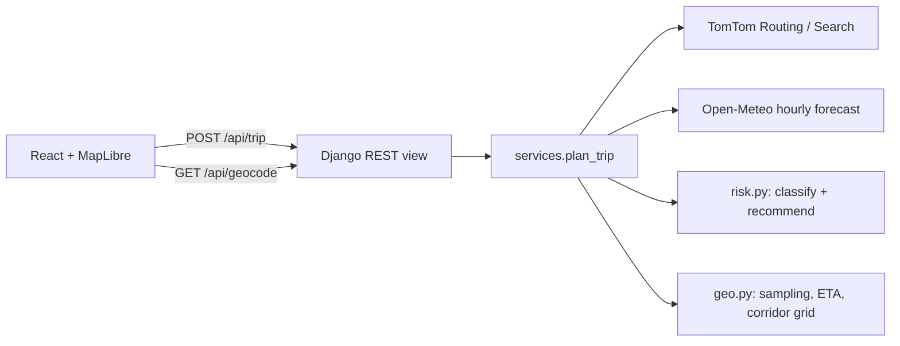

# Weather-Aware Truck Routing

React + Django app that helps a truck driver pick the safest route. It weighs forecast weather at the
truck's ETA, the load weight, and travel time.

- **Live app:** _add Render URL_
- **Walkthrough (Loom):** _add Loom URL_

## What it does

1. The driver enters origin, destination, departure time, load weight and a checkpoint interval (10 / 25 / 50 mi).
2. The backend asks TomTom for **3 truck routes**. The request uses `travelMode=truck`, the gross vehicle weight and the departure time, so traffic is predicted for that time.
3. Each route gets a **checkpoint every N miles** plus one at the destination. Each checkpoint has an **ETA** taken from TomTom's per-instruction travel times, so city and highway stretches each get their own speed.
4. Weather comes from **Open-Meteo hourly forecasts at each checkpoint's ETA** and is rated **Low → No Travel** with the risk table and the load rules.
5. Routes are **ranked**, and the best one is recommended with a one-line reason.
6. The map shows all routes, colour-coded checkpoints with popups (ETA, wind, gusts, rain, snow, reasons), route summary labels, and a **corridor weather heatmap with a 0–48 h forecast slider**. A truck marker shows where the selected route's truck is at the slider time.

## Architecture



One request returns everything the UI needs: routes, checkpoints, summaries, the recommendation and the
heatmap. The slider then runs entirely on the client and makes no network calls.

```
backend/trips/
  risk.py        risk bands, load rules, continuous heatmap score, summaries, ranking   (pure, unit-tested)
  geo.py         distance, interpolation, checkpoints, mile ownership, corridor grid    (pure, unit-tested)
  providers.py   TomTom + Open-Meteo clients (batched, parallel, cached)
  services.py    plan_trip(): orchestration
  serializers.py / views.py   request validation, HTTP
frontend/src/
  components/TripMap.tsx      MapLibre GL: heatmap, routes, checkpoints, labels, truck marker
  components/RouteCards.tsx   ranked route summaries
  components/ForecastSlider.tsx, TripForm.tsx, PlaceInput.tsx, Legend.tsx
  truck.ts       truck position at a given time (ETA -> mile -> point)
```

## Risk rules

Each checkpoint's level is the **worst** of wind (after load rules), rain and snow.

| Condition   | Low      | Moderate    | High        | Severe      | No Travel |
|-------------|----------|-------------|-------------|-------------|-----------|
| Wind (mph)  | < 25     | 25 – < 35   | 35 – < 45   | 45 – < 55   | ≥ 55      |
| Rain (in/hr)| < 0.10   | 0.10 – < 0.25 | 0.25 – < 0.50 | 0.50 – 1.00 | > 1.00  |
| Snow (in/hr)| < 0.5    | 0.5 – < 1.0 | 1.0 – < 2.0 | 2.0 – 3.0   | > 3.0     |

The spec's ranges share their endpoints (0.10–0.25, 0.25–0.50). Each band here includes its lower bound,
so 0.25 in/hr is High. "No Travel" follows the spec's `>` for rain and snow and `≥` for wind.

**Load rules** (wind only): ≥ 55 mph → No Travel for any load. 45–54 mph with load > 30,000 lb → No Travel.
35–44 mph with load > 40,000 lb → Severe.

## Recommendation

Routes are sorted by this tuple:

```
(No Travel miles, Severe miles, High miles, round(avg risk, 1), travel time)
```

- **Miles per level:** each checkpoint "owns" the stretch of road between the midpoints to its neighbours,
  so owned miles add up exactly to the route length. Average risk is the mile-weighted mean level (0–4).
- **No Travel is counted before Severe.** The spec ranks by "fewest Severe miles", but a No Travel mile is
  strictly worse, so 10 No Travel miles should never beat 50 Severe ones.
- **Average risk is compared at 0.1 resolution.** Without this, float noise would decide almost every tie
  and travel time would never count. Routes with near-identical risk fall through to the faster one.
- Each route gets a reason built from the first criterion where it differs from its comparison route,
  e.g. *"Best on Severe miles: 0 mi vs 12 mi on the next best route"*.
- If every route has No Travel miles, the UI suggests delaying departure.

## Weather sampling

- **Variables:** Open-Meteo `wind_speed_10m`, `wind_gusts_10m`, `rain` + `showers` (convective rain is
  reported separately and would otherwise be missed) and `snowfall`, in mph and inches.
- **Hour selection:** wind uses the hour nearest the ETA. Rain and snow use the hour *ending* after the ETA,
  because Open-Meteo reports precipitation as the total for the preceding hour.
- **Wind speed:** classification uses sustained wind. Gusts are shown in popups but are not part of the rules.
- **Fewer API calls:** checkpoints snap to a global 0.1° lattice (~7 mi). Overlapping routes and repeat
  requests then share forecasts, which are cached for 30 minutes.

## Corridor heatmap

- The backend builds a lattice of points within 30 mi of any route. Spacing adapts so there are at most
  ~220 points, and points are multiples of 0.1° so they share the weather cache.
- For each point it computes a **continuous, load-aware 0–4 score** for every hour 0–48 after departure.
  The score is piecewise-linear between the same thresholds, so its integer part matches the discrete level.
- The UI loads these as one MapLibre GeoJSON source with properties `h0..h48`. Moving the slider only swaps
  the `heatmap-weight` expression, blending neighbouring hours for smooth playback. It is GPU-rendered and
  makes no network calls.
- The kernel radius scales with grid spacing and zoom, so heat density ≈ score and the colours line up with
  the risk levels.

## API

`GET /api/geocode?q=chicago` → `[{label, lat, lon}]`

`POST /api/trip`
```json
{ "origin": {"lat": 41.88, "lon": -87.63, "label": "Chicago, IL"},
  "destination": {"lat": 39.74, "lon": -104.99, "label": "Denver, CO"},
  "departure": "2026-10-10T14:00:00Z", "load_lbs": 42000, "interval_miles": 25 }
```
→ `{ departure, recommended_id, all_routes_unsafe, routes: [{ id, rank, why, distance_mi, duration_s, arrival,
segments: [{level, coords}], checkpoints: [{mile, lat, lon, eta, wind_mph, gust_mph, rain_in, snow_in, level, reasons}],
summary: {miles_by_level, avg_risk, max_level} }], heatmap: { start, step_deg, points, scores } }`

Input rules: departure must be between now and 7 days ahead; load must be 0–80,000 lb; the interval must be
10, 25 or 50 mi; origin and destination must be at least 1 mi apart. Provider failures return 502/503 and
"no route" returns 422, each with a `detail` message.

## Running locally

Requirements: Python 3.12, Node 22+, and a free [TomTom API key](https://developer.tomtom.com) with the
Routing and Search APIs enabled.

```bash
# backend
cd backend
python -m venv .venv && .venv/bin/pip install -r requirements.txt
cp .env.example .env            # then set TOMTOM_API_KEY
.venv/bin/python manage.py runserver

# frontend (new terminal); Vite proxies /api to :8000
cd frontend && npm install && npm run dev
```

Tests cover risk bands at every threshold, load rules, ranking, mile ownership, ETA and hour selection,
and TomTom parsing:
```bash
cd backend && .venv/bin/python manage.py test trips
```

Docker (same image as production; Django serves the built SPA through WhiteNoise):
```bash
docker build -t weather-truck-routing .
docker run -p 8000:8000 -e TOMTOM_API_KEY=... -e SECRET_KEY=... weather-truck-routing
```

## Deploying (Render)

`render.yaml` defines a free Docker web service. Create a new Blueprint from this repo, set
`TOMTOM_API_KEY` when prompted, and deploy. `SECRET_KEY` is generated for you. The free tier sleeps
after 15 minutes idle, so the first request after that takes about 50 s.

## Assumptions and limitations

- **ETAs are continuous drive time** from TomTom's truck profile. Hours-of-Service breaks (30 min after
  8 h, 10 h rest after 11 h) are not added, so multi-day ETAs are optimistic.
- **Load weight is cargo weight.** TomTom routing gets gross weight = load + 35,000 lb typical tare.
- **Three routes:** TomTom sometimes returns fewer than 2 alternatives. The backend then requests detours
  through points offset sideways from the main route's midpoint and drops near-duplicates. These forced
  detours can include a small loop.
- **Forecast horizon:** departure is limited to 7 days out to stay within reliable hourly forecasts.
- **Open-Meteo free tier:** limits are 600 calls/min and 10k calls/day, counted per location. A long trip
  at 10 mi spacing uses a few hundred. Caching keeps repeat requests cheap; `OPEN_METEO_API_KEY` switches
  to the commercial endpoint.
- The in-memory cache is per process, which is fine for a single small instance. Use Redis for anything larger.
